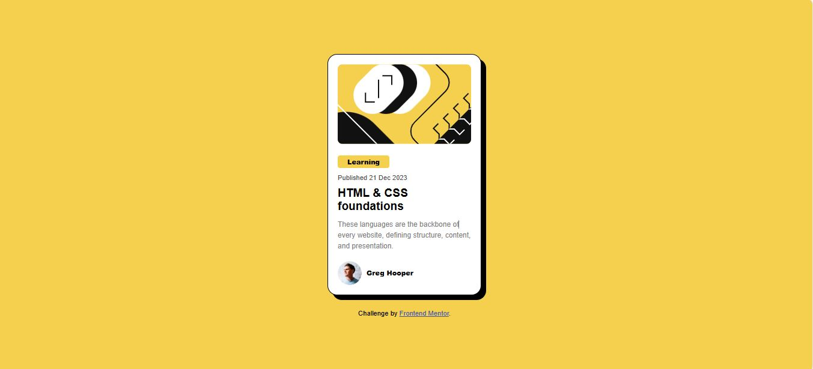

# Frontend Mentor - Blog Preview Card Solution

This is my solution to the **Blog Preview Card** challenge on [Frontend Mentor](https://www.frontendmentor.io/challenges/blog-preview-card-ckPaj01Ic).

## 📸 Screenshot

## 🔗 Live Site

[View live site here](https://blog-preview-card-chi-silk.vercel.app/)

## 🛠️ Built With

- Semantic HTML5 markup
- CSS3
- Flexbox
- Google Fonts (Figtree)
- Mobile-first workflow

## 🎯 Features

- Responsive layout
- Clean hover effects
- Focus on accessibility and readability
- Red + Yellow themed blog card with shadow and border-radius
- Hover state for the heading and card

## 🧠 What I Learned

- How to structure a simple card layout using Flexbox
- Applying consistent spacing using padding/margin
- Enhancing UX using `hover`, `transition`, and `cursor` properties
- Integrating Google Fonts properly
- Fine-tuning `box-shadow` and `border-radius` for a clean UI look
